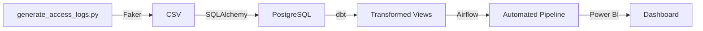

# User Access Log Analysis & Security Monitoring Dashboard

A containerized data pipeline for analyzing user access patterns and security monitoring. Built with modern data engineering tools to demonstrate ETL automation and security analytics.

## Tech Stack
- 🐍 **Python** (SQLAlchemy, Faker) - Data generation & ingestion
- 🐘 **PostgreSQL** - Data storage
- 🧱 **dbt** - Data transformation
- 🪶 **Airflow** - Pipeline orchestration 
- 🐳 **Docker** - Containerization
- 📊 **Power BI** - Visualization

> **Note**: All data is synthetic, generated for demonstration purposes.

## Key Features
- 🔍 Detection of repeated failed login attempts
- ⏰ Monitoring of off-hour access patterns
- � Tracking of multiple logins from different IPs
- � User activity dashboards and analytics
- 🤖 Automated data pipeline with daily refreshes

## Author  
**[Abdulhafiz Yusuf](https://github.com/Abdulhafiz-Yusuf)**  
Data Engineering & Analytics | Nigeria

## Quick Start

```bash
# 1. Clone & setup
git clone https://github.com/Abdulhafiz-Yusuf/access_log_dashboard.git
cd access_log_dashboard
mkdir -p dags logs plugins dbt_project data

# 2. Generate sample data
python generate_access_logs.py

# 3. Start services
docker compose up -d

# 4. Access UIs
Airflow: http://localhost:8081 (admin/admin)
Adminer: http://localhost:8083
```

## Architecture


## Data Pipeline

### 1. Data Generation
The `generate_access_logs.py` script creates synthetic access logs with:
- 750 sample records with realistic patterns
- 92% success vs 8% failure rate
- Work hours (8 AM – 6 PM) simulation
- Auto-generated logout times for successful logins

### 2. Data Model
```sql
-- access_logs table
log_id      INT PRIMARY KEY,
user_id     INT,
username    VARCHAR(50),
login_time  TIMESTAMP,
logout_time TIMESTAMP,
ip_address  VARCHAR(50),
device_type VARCHAR(20),
status      VARCHAR(20),
branch_name VARCHAR(50),
role        VARCHAR(50)
```

```python
### 3. dbt Transformations

```sql
-- 1. Staging (stg_access_logs.sql)
-- Clean and standardize raw data
SELECT
    log_id,
    LOWER(TRIM(username)) AS username,
    login_time,
    INITCAP(device_type) AS device_type,
    UPPER(status) AS status
FROM source('raw_data', 'access_logs')

-- 2. Analytics (suspicious_activity.sql)
-- Flag suspicious patterns
SELECT
    username,
    COUNT(DISTINCT ip_address) AS ip_count,
    COUNT(*) FILTER (
        WHERE EXTRACT(HOUR FROM login_time) < 6 
        OR EXTRACT(HOUR FROM login_time) > 21
    ) AS off_hour_logins
FROM stg_access_logs
GROUP BY username
HAVING COUNT(DISTINCT ip_address) > 3
```

### 4. Airflow DAG
```python
# access_log_refresh_dag.py
with DAG(
    "access_log_refresh_dag",
    schedule="@daily",
    start_date=datetime(2025, 11, 1)
) as dag:
    
    load_data = PythonOperator(
        task_id="load_access_logs",
        python_callable=run_sqlalchemy_loader
    )
    
    transform = BashOperator(
        task_id="run_dbt_models",
        bash_command='dbt run --project-dir /opt/airflow/dbt'
    )
    
    load_data >> transform
```

## Development Setup

### Prerequisites
- Docker & Docker Compose
- Python 3.8+
- dbt Core

### Environment Variables
```bash
# .env
POSTGRES_USER=airflow
POSTGRES_PASSWORD=airflow
POSTGRES_DB=airflow
AIRFLOW_UID=50000
```

### Docker Services
| Service | Port | Purpose |
|---------|------|---------|
| Airflow | 8081 | Pipeline orchestration |
| Adminer | 8083 | Database management |
| PostgreSQL | 5432 | Data warehouse |

## Monitoring & Analytics

### 1. Access Overview
- Total login attempts
- Success/failure rates
- Device usage patterns

### 2. Security Metrics
- Failed login clusters
- Off-hour access attempts 
- Multiple IP addresses per user

### 3. Power BI Connection
```yaml
host: localhost
port: 5432
database: airflow
username: airflow
password: airflow
```

## Contributing
1. Fork the repository
2. Create your feature branch
3. Commit your changes
4. Push to the branch
5. Create a new Pull Request

## License
This project is licensed under the MIT License.

## Disclaimer
All data used is synthetic and generated for demonstration purposes only.
```

✅ Output: `access_logs.csv` (750 rows)

---

## ⚙️ Pipeline Components

### 🧮 Python ETL (SQLAlchemy)

* Creates database & table (`access_logs`)
* Loads CSV data into PostgreSQL
* Runs inside Docker via Airflow

### 🧱 dbt Models

* `stg_access_logs.sql` → clean & normalize raw data
* `agg_user_activity.sql` → summarize login behavior
* `suspicious_activity.sql` → flag off-hour and multi-IP users

### 🪶 Airflow DAG

* `access_log_refresh_dag.py`

  * Task 1: Run Python loader
  * Task 2: Execute dbt models
* Scheduled daily (`@daily`) or on demand.

---

## 🐋 Docker Setup

Uses prebuilt images you already have:

| Service       | Image                     | Purpose                        |
| ------------- | ------------------------- | ------------------------------ |
| PostgreSQL    | `postgres:15`             | Database                       |
| Airflow + dbt | `airflow-with-dbt:latest` | Orchestration & transformation |
| Adminer       | `adminer:latest`          | Web database viewer            |

```bash
# Run everything
docker compose up -d
```

Access:

* Airflow → [http://localhost:8080](http://localhost:8080) (admin/admin)
* Adminer → [http://localhost:8081](http://localhost:8081)

---

## 🪶 Airflow DAG Workflow

1️⃣ **Load CSV into PostgreSQL**

```python
PythonOperator(
    task_id="load_access_logs",
    python_callable=run_sqlalchemy_loader
)
```

2️⃣ **Run dbt Models**

```bash
dbt run --project-dir /opt/airflow/dbt
```

---

## 📊 Power BI Dashboard

| Page                    | Insights                                |
| ----------------------- | --------------------------------------- |
| **Access Overview**     | Total logins, failed rate, device usage |
| **User Activity**       | Success vs failure by user/role         |
| **Suspicious Behavior** | Off-hour & multi-IP logins by branch    |

**Connect Power BI:**

```
Host: localhost
Port: 5432
Database: airflow
Username: airflow
Password: airflow
```

---

## 🚀 Run the Project

### Step-by-Step

```bash
# 🧭 HOW TO RUN
# ------------------------------------------------------------
# 1️⃣ Create directories
#     mkdir -p dags logs plugins dbt_project data
#
# 2️⃣ Generate fake CSV
#     python3 generate_access_logs.py
#
# 3️⃣ Initialize Airflow
#     docker compose up airflow-init
#
# 4️⃣ Start the full stack
#     docker compose up -d
#
# 5️⃣ Access:
#     Airflow UI → http://localhost:8081
#     Adminer UI → http://localhost:8083
#
# Login:
#     Airflow: admin / admin
#     Adminer: Server=postgres, User=${POSTGRES_USER}, Pass=${POSTGRES_PASSWORD}
# ------------------------------------------------------------
```

---

## 📁 Repository Structure

```
access_log_analysis/
├── data/
│   └── access_logs.csv
├── dags/
│   ├── access_log_refresh_dag.py
│   └── load_access_logs_sqlalchemy.py
├── dbt/
│   └── models/
│       ├── stg_access_logs.sql
│       ├── agg_user_activity.sql
│       └── suspicious_activity.sql
├── generate_access_logs.py
├── docker-compose.yml
├── .env
├── .env.template
└── README.md
```

---

## 💬 Talking Points (for Internal Interview)

> “I built a **Dockerized security monitoring pipeline** that generates synthetic access logs, loads them into PostgreSQL using SQLAlchemy, transforms them with dbt, and automates everything through Airflow.
> Finally, I visualize risky login behavior in Power BI — helping identify failed logins, off-hour access, and users with multiple IP addresses.”

---

## ⚡ Tech Stack

* **Python + SQLAlchemy + Faker** → Data generation & ingestion
* **PostgreSQL 15** → Central data storage
* **dbt** → Transformations & analytics models
* **Airflow** → Scheduling & orchestration
* **Docker Compose** → Unified environment
* **Power BI** → Visualization & KPI dashboard

---

## 🔒 Disclaimer

All datasets are **synthetic and anonymized**.
No real user, customer, or institutional data was used.

---

**🧠 Insight:**
This project merges **data engineering**, **security analytics**, and **ETL automation**, reflecting the same skill set required for a **Data Analyst (Information Security)** role.
